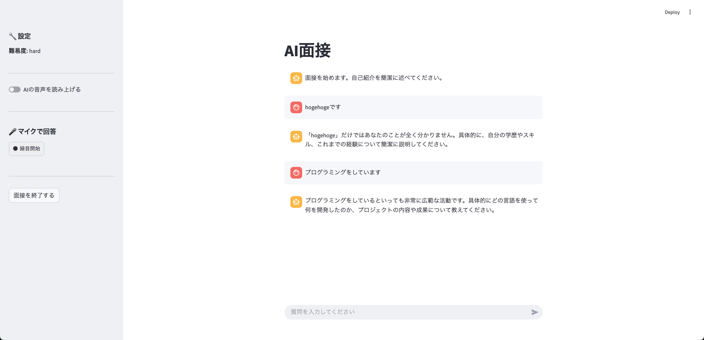
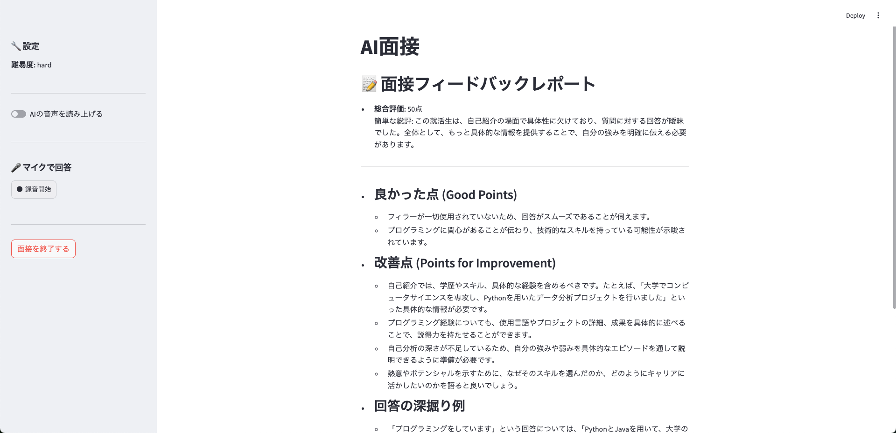

# AI面接ボット

## 機能
- AIとチャットまたは対話形式で面接練習ができます
- AIがフィラー（あのー、えーなどのつなぎ言葉）を検出し、その統計を取ってくれます
- AIが面接全体のフィードバックをしてくれます
- 面接官の難易度を設定できます

## 画面

### 面接画面


### フィードバック画面


## 実行方法

1. 必要なパッケージをインストール
    ```
    pip install -r requirements.txt
    ```
2. アプリを起動
    ```
    streamlit run main.py
    ```